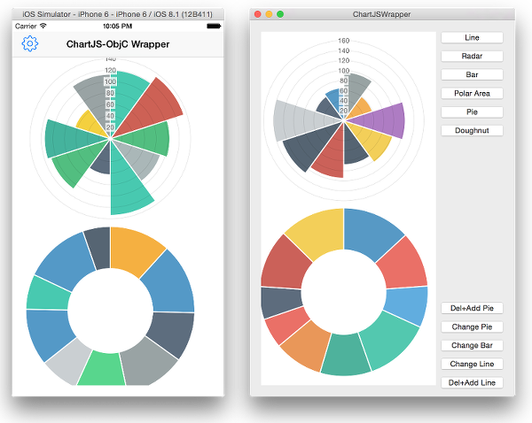

# Chart.js-ObjC-Wrapper
An Objective-C wrapper around Chart.js. 

<p align="center">
	
	<p align="center">
		<em>Chart.js wrapper</em>
	</p>
</p>

#Description
This package can be used in conjunction with WKWebView/WebView to add [Chart.js](http://www.chartjs.org) charts to a native iOS/OSX application. 


#Usage
##Project preparation
1. add WebKit framework to you app
2. add all the files in CW folder to your project
3. include CW.h

Chart.js wrapper needs a webview to use to execute java script functions and display the chart. You need to prepare the webview to include Char.js script and cw.js which provides java script functions to the wrapper. 

###iOS
You need to add a WKWebView to your ui and load the cw.html.
```objective-c
- (void)viewDidLoad {
	[super viewDidLoad];
	[self createMenu];
	
	WKWebView* webview = [[WKWebView alloc] initWithFrame:self.wview.bounds];

//  ... add code here to insert webview to UI - for an example see the sample app	

	self.webview = webview;
	NSString *resourcesPath = [[NSBundle mainBundle] resourcePath];
	NSString *htmlPath = [resourcesPath stringByAppendingString:@"/cw.html"];
	[self.webview loadRequest:[NSURLRequest requestWithURL:[NSURL fileURLWithPath:htmlPath]]];
}
```
###OSX
On OSX you can add a WebView to your app in IB. You need to add an outlet reference to this WebView and load cw.html
```objective-c
- (void)applicationDidFinishLaunching:(NSNotification *)aNotification {
	NSString *resourcesPath = [[NSBundle mainBundle] resourcePath];
	NSString *htmlPath = [resourcesPath stringByAppendingString:@"/cw.html"];
	[[self.webview mainFrame] loadRequest:[NSURLRequest requestWithURL:[NSURL fileURLWithPath:htmlPath]]];
}
```
##Using wrapper classes
The wrapper supports all the chart types provided by Chart.js by separate class:
- Line : ```CWLineChart/CWLineChartData/CWLineChartOptions/CWPointDataSet```
- Radar : ```CWRadarChart/CWRadarChartData/CWRadarChartOptions/CWPointDataSet```
- Bar : ```CWBarChart/CWBarChartData/CWBarChartOptions/CWBarDataSet```
- Polar Area : ```CWPolarAreaChart/CWSegmentData/CWPolarAreaChartOptions```
- Pie : ```CWPieChart/CWSegmentData/CWPieChartOptions``` 
- Doughnut : ```CWDoughnutChart/CWSegmentData/CWPieChartOptions```

All these classes are representations of Chart.js classes (prototypes). The property and method names are the same as in the Chart.js.
In the chart options there are two differences:
1. the colors are represented by NSColor/UIColor instead of CSS color string (```rgba(123,43,56,0.8)```)
2. in order to create proper JSON from the objects the boolean values are represented by a CWBoolean. You can use cwYES/cwNO.

###Examples
Add a LineChart
```objective-c
- (void)addLine {
	NSArray* labels = [NSMutableArray arrayWithArray:@[@"A",@"B",@"C",@"D"]];
	NSMutableArray* datasets = [NSMutableArray array];
	for(NSInteger i = 1; i < 4; i++) {
		CWPointDataSet* ds = [[CWPointDataSet alloc] initWithData:@[@([self random:100]),@([self random:100]),@([self random:100]),@([self random:100])]];
		ds.label = [NSString stringWithFormat:@"Label %ld",i];
		CWColor* c1 = [[CWColors sharedColors] pickColor];
		CWColor* c2 = [c1 colorWithAlphaComponent:0.5f];
		ds.fillColor = c2;
		ds.strokeColor = c1;
		[datasets addObject:ds];
	}
	
	CWLineChartData* lcd = [[CWLineChartData alloc] initWithLabels:labels andDataSet:datasets];
	self.lineChart = [[CWLineChart alloc] initWithWebView:self.webview name:@"LineChart1" width:300 height:200 data:lcd options:nil];
	[self.lineChart addChart];
}
```
Delete the first point set from the line chart data, then append a new point set to it.
```objective-c
- (void)delAddLine {
	[self.lineChart removeData];
	[self.lineChart addData:@[@([self random:100]),@([self random:100]),@([self random:100]),@([self random:100])] label:@"W"];
}
```
Change all the points in the line chart.
```objective-c
- (void)changeLine {
	for(NSInteger i = 1; i < 4; i++) {
		[self.lineChart setValue:@([self random:100]) inDataset:i-1 at:0];
		[self.lineChart setValue:@([self random:100]) inDataset:i-1 at:1];
		[self.lineChart setValue:@([self random:100]) inDataset:i-1 at:2];
		[self.lineChart setValue:@([self random:100]) inDataset:i-1 at:3];
	}
	[self.lineChart update];
}
```
#CWColors library
The project contains a small color library to access [Flat UI Colors](http://flatuicolors.com)

You can pick random colors by ```[[CWColors sharedColors] pickColor]``` or access colors by name ```[CWColors sharedColors].colors[CWCAsbestos];``` with the following constants:
```objective-c
extern NSString *const CWCTurquise;
extern NSString *const CWCEmerald;
extern NSString *const CWCPeterRiver;
extern NSString *const CWCAmethyst;
extern NSString *const CWCWetAsphalt;
extern NSString *const CWCGreenSea;
extern NSString *const CWCNephritis;
extern NSString *const CWCBelizeHole;
extern NSString *const CWCWisteria;
extern NSString *const CWCMidnightBlue;
extern NSString *const CWCSunFlower;
extern NSString *const CWCCarrot;
extern NSString *const CWCAlizarin;
extern NSString *const CWCClouds;
extern NSString *const CWCConcrete;
extern NSString *const CWCOrange;
extern NSString *const CWCPumpkin;
extern NSString *const CWCPomegrante;
extern NSString *const CWCSilver;
extern NSString *const CWCAsbestos;
```
This small library contains 20 colors only, if you are interested in a more comprehensive color library, which contains more than 1200 colors, you should look at [Rainbow](https://github.com/NorthernRealities/Rainbow)

#Sample Application
The sample application shows the basic usage of the wrapper.

#Acknowledgement
1. The iOS sample application uses [iOSPullDownMenu](https://github.com/BernardGatt/iOSPullDownMenu)
2. The color library contains color from [Flat UI Colors](http://flatuicolors.com)

#License
MIT

